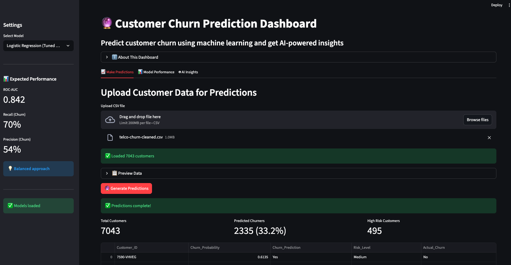

# 🔮 Customer Churn Prediction Dashboard

An end-to-end machine learning project that predicts telecom customer churn with interactive visualizations and AI-powered insights.



## 🎯 Project Overview

This project demonstrates a complete ML workflow from data exploration to production deployment:
- Exploratory data analysis with key business insights
- Multiple ML models trained and compared (Logistic Regression, Random Forest, XGBoost)
- Model optimization using threshold tuning and SMOTE for class imbalance
- Interactive Streamlit dashboard for predictions
- AI-generated business insights using Claude API

**Key Achievement:** Improved churn detection recall from 56% to 70% while maintaining 0.84+ ROC-AUC score.

## 🚀 Features

- **📊 Multi-Model Comparison**: Choose between 4 different ML models
- **🎯 Batch Predictions**: Upload CSV files for bulk customer predictions
- **📈 Performance Metrics**: Interactive confusion matrices and ROC curves
- **🤖 AI-Powered Insights**: Business recommendations generated by Claude AI
- **💾 Downloadable Results**: Export predictions as CSV

## 🛠️ Tech Stack

- **Python 3.11**
- **Machine Learning**: scikit-learn, XGBoost, imbalanced-learn
- **Data Processing**: pandas, numpy
- **Visualization**: Plotly, seaborn, matplotlib
- **Dashboard**: Streamlit
- **AI Integration**: Anthropic Claude API
- **Development**: Jupyter, Git

## 📊 Models & Performance

| Model | ROC-AUC | Recall | Precision | Use Case |
|-------|---------|--------|-----------|----------|
| **Logistic Regression (Tuned)** | 0.842 | 70% | 54% | Best balanced approach |
| Logistic Regression (Default) | 0.842 | 56% | 66% | Conservative predictions |
| Random Forest | 0.843 | 52% | 66% | High precision |
| XGBoost (SMOTE) | 0.824 | 71% | 52% | Maximum churn detection |

## 🚀 Quick Start

### Prerequisites
- Python 3.10+
- pip or conda

### Installation

1. Clone the repository
```bash
git clone https://github.com/shreyeshi-somya/churn-prediction-dashboard.git
cd churn-prediction-dashboard
```

2. Create virtual environment
```bash
python3.11 -m venv venv
source venv/bin/activate  # On Windows: venv\Scripts\activate
```

3. Install dependencies
```bash
pip install -r requirements.txt
```

4. Set up API key (for AI insights)
```bash
echo "ANTHROPIC_API_KEY=your_key_here" > .env
```

5. Run the dashboard
```bash
streamlit run src/app.py
```

## 📁 Project Structure
```
churn-prediction-dashboard/
├── data/
│   ├── telco-churn-data.csv          # Original dataset
│   └── telco-churn-cleaned.csv       # Cleaned dataset
├── models/
│   ├── best_model_config.pkl         # Tuned LR model
│   ├── logistic_regression_model.pkl # Default LR model
│   ├── random_forest_model.pkl       # RF model
│   ├── xgboost_model.pkl            # XGBoost model
│   ├── scaler.pkl                   # Feature scaler
│   └── feature_names.pkl            # Feature list
├── notebooks/
│   ├── 01_exploratory_data_analysis.ipynb
│   └── 02_model_training.ipynb
├── src/
│   └── app.py                       # Streamlit dashboard
├── requirements.txt
└── README.md
```

## 🔍 Key Insights

**From EDA:**
- 26.5% overall churn rate
- Month-to-month contracts have 42.7% churn vs 2.8% for 2-year contracts
- Contract type is the strongest predictor of churn

**Model Optimization:**
- Initial baseline: 56% recall, 66% precision
- After threshold tuning: 70% recall, 54% precision
- Trade-off optimization based on business cost of false negatives vs false positives

## 🎓 Learning Outcomes

This project demonstrates proficiency in:
- End-to-end ML pipeline development
- Handling imbalanced datasets
- Model evaluation and optimization
- Interactive dashboard development
- API integration
- Git workflow and documentation

## 📝 Future Enhancements

- [ ] Add SHAP values for model explainability
- [ ] Implement real-time prediction API
- [ ] Add feature importance visualization
- [ ] Deploy with Docker
- [ ] Add automated retraining pipeline

## 👤 Author

**Your Name**
- LinkedIn: [Shreyeshi Somya](https://www.linkedin.com/in/sshreyeshi/)
- Email: sshreyeshi@gmail.com

## 📄 License

This project is open source and available under the MIT License.

## 🙏 Acknowledgments

- Dataset: [IBM Sample Data Sets](https://www.kaggle.com/datasets/blastchar/telco-customer-churn)
- Claude AI by Anthropic for insights generation